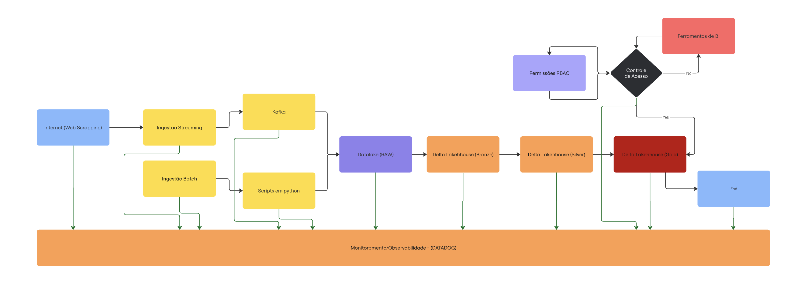

# Teste Técnico para a Winnin

1. Visão Geral
Este documento apresenta a arqu, itetura proposta para o processamento de dados gerados através da coleta de dados realizada através de web scrapping em páginas da internet, contemplando fluxos de ingestão em tempo real (streaming) e em lotes (batch) visando crescimento da plataforma em um processo de expansão, ou processamento massivo. A solução utiliza uma abordagem moderna de lakehouse, com camadas bem definidas para garantir a qualidade, governança e disponibilidade dos dados para análises.

- Para maiores informações sobre a proposta de arquitetura, acesse o documento em pdf disponível no repositório deste projeto:
  - [Data Engineer - winnin - portuguese.pdf](pdf/Data%20Engineer%20-%20winnin%20-%20portuguese.pdf)

## Como executar o projeto, seguir procedimentos abaixo:
### Pré-requisitos
- Ter uma conta no Databricks Community Edition (gratuito)
- realizar o download do arquivo `winnin_project.dbc` disponível no repositório deste projeto.
- Caso não tenha uma conta ainda, siga os passos abaixo para criar uma:
  - Use o Databricks Community Edition. Se necessário, cadastre-se em
  https://www.databricks.com/try-databricks#account e escolha "Get started with
  Community Edition".
- Após o cadastro, você receberá um e-mail de confirmação. Clique no link
- Agora siga os passos abaixo para importar o notebook e conseguir executar o projeto:
  - Acesse a sua conta no Databricks Community Edition.
  - Ao fazer login, crie um cluster no menu "Compute".
  - Acesse o menu "Workspace" e crie uma nova pasta para o projeto.
  - Dentro da pasta criada, importe o aquivo `winnin_project.dbc` que você baixou do repositório.:

## Caso você não queira usar o databricks para executar o projeto, siga os passos abaixo:
### Pré-requisitos
- Acessar o diretório html deste repositório.
- Realizar o download dos arquivos html disponíveis no diretório `html` deste repositório: 
  - [[01] - wiki_pages.json.gz.html](html/%5B01%5D%20-%20wiki_pages.json.gz.html)
  - [[02] - posts_creator_json.json.gz.html](html/%5B02%5D%20-%20posts_creator_json.json.gz.html)
  - [[03] - create_table_user_yt_from_wikipedia_api.html](html/%5B03%5D%20-%20create_table_user_yt_from_wikipedia_api.html)
  - [[04] - analyze_creators.html](html/%5B04%5D%20-%20analyze_creators.html)
- Abrir o arquivo html baixado em um navegador web (ex: Google Chrome, Firefox, etc).